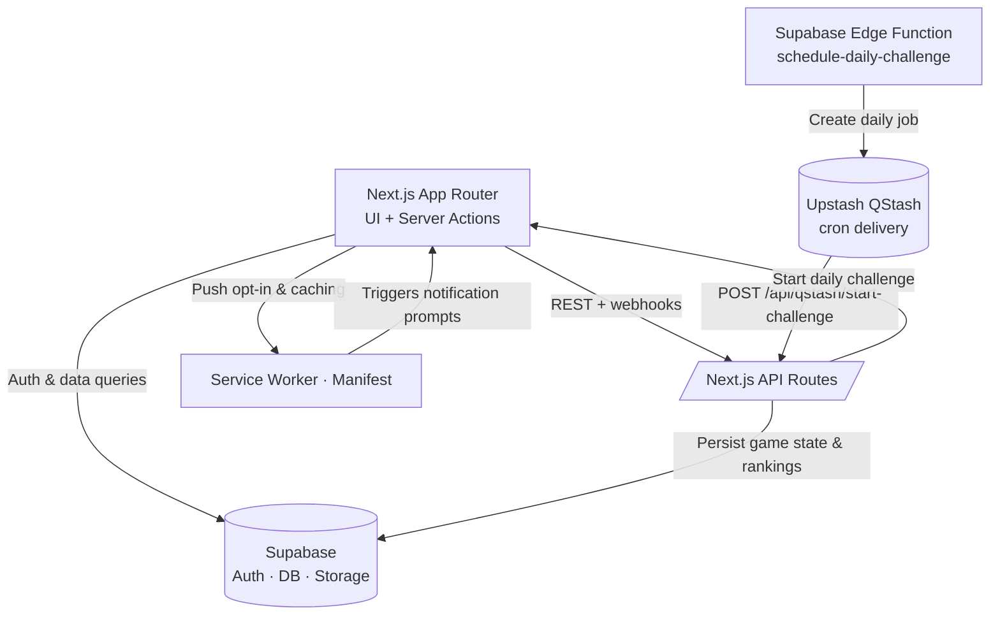

# Sabeo

A word-guessing game inspired by Wordle with BeReal-style random notifications. Players get six attempts to guess a five or six-letter word and receive color-coded feedback after every guess.

- 🟩 Green: correct letter, correct slot
- 🟨 Yellow: correct letter, wrong slot
- ⬜ Gray: letter not in the word

## Features

- ✅ Random notifications (PWA)
- ✅ Global and daily rankings
- ✅ Daily challenges
- ✅ Social authentication
- ✅ Mobile-first design
- ✅ Real-time updates
- ✅ Push notifications
- ✅ Daily streak tracking

## Architecture



## Structure

```
sabeo/
├── src/app              # App Router routes, layouts, API routes, server actions
├── src/components       # UI modules and primitives under ui/
├── src/domain           # mecánicas del juego y contratos del dominio
│   ├── challenge/       # colores, queries del reto, start-challenge
│   └── ranking/         # tipos + queries del ranking
├── src/lib              # integraciones (Supabase, auth, env, PWA, QStash)
├── src/hooks            # client state (e.g., useLocalStorage)
├── scripts              # utilities like process-dictionary
├── supabase             # edge functions, config, migrations
└── public               # assets, icons, manifest
```

## Local requirements

- Bun
- Supabase CLI + Docker Engine/Desktop
- mkcert (`mkcert -install` once for local HTTPS)
- hunspell (needed for `process-dictionary`)

## Dictionary

Edit `data/dictionary-es.txt` and run `bun run process-dictionary` to rebuild the Hunspell-based word list.

## Push notifications

Generate VAPID keys with `bunx web-push generate-vapid-keys --json` and copy the values into your environment before hitting `/api/subscribe` or `/api/notify`.

## Daily cron

Iterate locally with `supabase functions serve schedule-daily-challenge --env-file .env`. Deploy the cron with:

```bash
supabase functions deploy schedule-daily-challenge \
  --project-ref <project_ref> \
  --import-map supabase/functions/schedule-daily-challenge/deno.json \
  --env-file .env.production \
  --schedule "0 12 * * *"
```

Keep Supabase, Vercel, and Upstash secrets in sync; pause the cron by removing the schedule from Supabase CLI or Upstash.
Set `START_CHALLENGE_URL` to your deployed host (e.g., `https://sabeo.vercel.app`) when deploying the edge function so QStash posts to the right API.

## Environment variables

| Variable |
| --- |
| NEXT_PUBLIC_SUPABASE_URL |
| NEXT_PUBLIC_SUPABASE_ANON_KEY |
| SUPABASE_SERVICE_KEY |
| SUPABASE_FUNCTION_SECRET |
| START_CHALLENGE_INTERNAL_KEY |
| START_CHALLENGE_URL |
| NEXT_PUBLIC_VAPID_PUBLIC_KEY |
| VAPID_PRIVATE_KEY |
| NOTIFICATIONS_PRIVATE_KEY |
| QSTASH_TOKEN |
| QSTASH_URL |
| QSTASH_CURRENT_SIGNING_KEY |
| QSTASH_NEXT_SIGNING_KEY |
