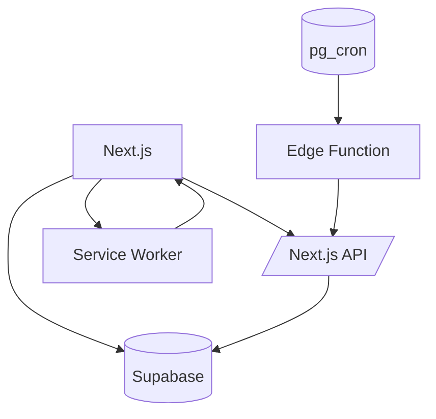

# Sabeo

A word-guessing game inspired by Wordle with BeReal-style random notifications. Players get six attempts to guess a five or six-letter word and receive color-coded feedback after every guess.

- 🟩 Green: correct letter, correct slot
- 🟨 Yellow: correct letter, wrong slot
- ⬜ Gray: letter not in the word

## Features

- ✅ Random notifications (PWA)
- ✅ Global and daily rankings
- ✅ Daily challenges
- ✅ Social authentication
- ✅ Mobile-first design
- ✅ Real-time updates
- ✅ Push notifications
- ✅ Daily streak tracking

## Architecture



## Structure

```
sabeo/
├── src/app              # App Router routes, layouts, API routes, server actions
├── src/components       # UI modules and primitives under ui/
├── src/domain           # mecánicas del juego y contratos del dominio
│   ├── challenge/       # colores, queries del reto, start-challenge
│   └── ranking/         # tipos + queries del ranking
├── src/lib              # integraciones (Supabase, auth, env, PWA)
├── src/hooks            # client state (e.g., useLocalStorage)
├── scripts              # utilities like process-dictionary
├── supabase             # edge functions, config, migrations
└── public               # assets, icons, manifest
```

## Local requirements

- Bun
- Supabase CLI + Docker Engine/Desktop
- mkcert (`mkcert -install` once for local HTTPS)
- hunspell (needed for `process-dictionary`)

## Dictionary

Edit `data/dictionary-es.txt` and run `bun run process-dictionary` to rebuild the Hunspell-based word list.

## Push notifications

Generate VAPID keys with `bunx web-push generate-vapid-keys --json` and copy the values into your environment before hitting `/api/subscribe` or `/api/notify`.

## Daily cron

Iterate locally with `supabase functions serve schedule-daily-challenge --env-file .env`.

### Production schedule via pg\_cron

El cron en producción (pg\_cron + pg\_net) llama al Edge Function cada 10 minutos dentro de la ventana 08:00–16:00 (Bogotá). El Edge Function guarda en `jobs.daily_challenge_schedule` el día y la hora aleatoria que le tocó a ese reto y, cuando llega ese timestamp, hace un POST a `/api/start-challenge`. Ese API route aplica penalidades, marca el siguiente reto como iniciado y dispara las notificaciones push. Con esto la arquitectura queda:

- **pg\_cron**: temporizador que invoca `jobs.run_schedule_daily_challenge`.
- **Edge Function**: decide la hora aleatoria diaria, persiste el registro y dispara `/api/start-challenge` cuando corresponde.
- **Next.js API (`/api/start-challenge`)**: lógica central para activar el reto y enviar notificaciones; también sirve como fallback manual si necesitas iniciar un challenge sin pasar por el cron.
- **Supabase Vault**: guarda `schedule_daily_challenge_url` (URL completa del Edge Function) y `service_role_key`, claves que la función usa para autenticarse.

### Edge function deploy

Deploy the Edge Function (needed so pg\_cron has something to invoke) and ensure `SUPABASE_SERVICE_ROLE_KEY` is available when deploying:

```bash
supabase functions deploy schedule-daily-challenge \
  --project-ref <project_ref> \
  --import-map supabase/functions/schedule-daily-challenge/deno.json \
  --env-file .env.production
```

Keep Supabase and Vercel secrets in sync. Set `START_CHALLENGE_URL` to your deployed host (e.g., `https://sabeo.vercel.app`) so the Edge Function can hit the API.

## Environment variables

| Variable |
| --- |
| NEXT_PUBLIC_SUPABASE_URL |
| NEXT_PUBLIC_SUPABASE_ANON_KEY |
| NEXT_PUBLIC_VAPID_PUBLIC_KEY |
| SUPABASE_SERVICE_ROLE_KEY |
| START_CHALLENGE_URL |
| VAPID_PRIVATE_KEY |
