# Sabeo

A side project, definitely-not-original and probably overengineered, inspired by Wordle. Players get six attempts to guess a five or six-letter word and receive color-coded feedback after every guess.

- 🟩 Green: correct letter, correct slot
- 🟨 Yellow: correct letter, wrong slot
- ⬜ Gray: letter not in the word

## Features

- ✅ Random notifications (PWA)
- ✅ Global and daily rankings
- ✅ Daily challenges
- ✅ Social authentication
- ✅ Mobile-first design
- ✅ Real-time updates
- ✅ Push notifications
- ✅ Daily streak tracking

## Architecture

```mermaid
sequenceDiagram
  actor User
  participant SW as Service Worker
  
  box Next.js App
    participant UI as Client
    participant API as API Routes
  end
  
  box Supabase
    participant DB as Database
    participant Cron as pg_cron
  end
  
  participant Push as Push Service
  
  Note over User,API: Subscription Flow
  User->>UI: Enable notifications
  UI->>SW: Request subscription
  SW-->>API: POST /api/subscribe
  API->>DB: Store subscription
  
  Note over Cron,API: Schedule challenge with random time (8AM-4PM COT)
  Cron->>API: POST /api/schedule-daily-challenge
  
  Note over Push,API: At scheduled time start challenge and send notifications
  Cron->>API: POST /api/start-challenge
  API->>Push: Send notifications payload
  Push->>SW: Deliver push
  SW->>User: Show notification
```

## Local requirements

- Bun
- Supabase CLI + Docker
- mkcert (`mkcert -install` once for local HTTPS); on macOS it may not be needed, install only if dev HTTPS fails.
- hunspell (only needed if you re-run `process-dictionary`)

## Development setup

- Install dependencies: `bun install`.
- Run the app: `bun run dev` (HTTPS; reinstall certs with `mkcert -install` if needed).
- Dictionary: edit `data/dictionary-es.txt` and run `bun run process-dictionary` to regenerate the word list (requires hunspell).

## Supabase setup

- Authenticate and link once: `supabase login` then `supabase link --project-ref <project_ref>`. After linking, omit `--project-ref` in the remaining commands.
- Start local stack: `supabase start`.
- Local migrations: after creating files under `supabase/migrations`, apply locally with `supabase db reset` (recreates local state).
- Remote migrations: `supabase db up` (uses the linked project).
- Daily challenge scheduling is handled by the Next API route `/api/schedule-daily-challenge`, and the challenge is started and notifications sent in `/api/start-challenge`.

### Supabase secrets

- Supabase Vault (for pg\_cron): exact names `SCHEDULE_DAILY_CHALLENGE_URL` (pointing to the Next API route) and `SUPABASE_SERVICE_ROLE_KEY` (used by `run_schedule_daily_challenge`), plus VAPID keys if needed by other functions.
- Google auth: set up Google in the Supabase dashboard following https://supabase.com/docs/guides/auth/social-login/auth-google and provide `SUPABASE_AUTH_GOOGLE_CLIENT_ID` / `SUPABASE_AUTH_GOOGLE_SECRET` (Google Cloud Console) in Supabase and your local `.env`.

## Daily challenge routes (high-level)

- `/api/schedule-daily-challenge` creates or updates the daily schedule row for the current date and stores the notification `message` that will be sent.
- The `daily_challenge_schedule` table is the daily control record: it records the day, the scheduled time, whether it was triggered, and which challenge is tied to it.
- If there is no pending challenge when scheduling runs, the route still creates a row with `scheduled_run_at`, `triggered_at`, and `challenge_id` set to `null`. That row marks the day as “no challenge available,” and the scheduler will respond 404.
- `/api/start-challenge` only runs when a schedule row exists and has a `scheduled_run_at`; it reads the message from the schedule row and sends the push notification.

## Push notifications

Generate VAPID keys with `bunx web-push generate-vapid-keys --json` and copy the values into your environment before hitting `/api/subscribe` or `/api/notify`.

## Environment variables

| Variable |
| --- |
| NEXT_PUBLIC_SUPABASE_URL |
| NEXT_PUBLIC_SUPABASE_ANON_KEY |
| NEXT_PUBLIC_VAPID_PUBLIC_KEY |
| SUPABASE_URL |
| SUPABASE_SERVICE_ROLE_KEY |
| VAPID_PRIVATE_KEY |
| SUPABASE_AUTH_GOOGLE_CLIENT_ID |
| SUPABASE_AUTH_GOOGLE_SECRET |

## Ranking rules

Ranking behavior is defined in `supabase/migrations/20251116055924_change_ranking_system.sql` and consumed by `src/domain/ranking/queries.ts`.

- Base scoring: each completed daily challenge grants 1 point; `award_season_points_trigger` on `challenges_completed` updates `season_scores`.
- Fast bonus: +1 if the challenge is finished within 60 seconds of first opening it (tracked in `challenges_opened` via `register_challenge_open`).
- Streak bonus: consecutive daily completions increment `current_streak`; when the streak grows and that streak day hasn’t been rewarded yet, +1 is added. Missing a day breaks the streak and restarts it on the next play (no points are subtracted when the streak breaks).
- Inactivity penalty: `apply_inactivity_penalties` increments `missed_in_a_row` for days without play and, starting on the 4th consecutive miss, subtracts 1 point per check (floored at 0) and clears fast bonus flags.
- Ranking query: `get_active_season_ranking` orders by `season_points` desc, then `current_streak` desc, then `updated_at` asc. Keep migrations and query logic aligned whenever the formula changes.
